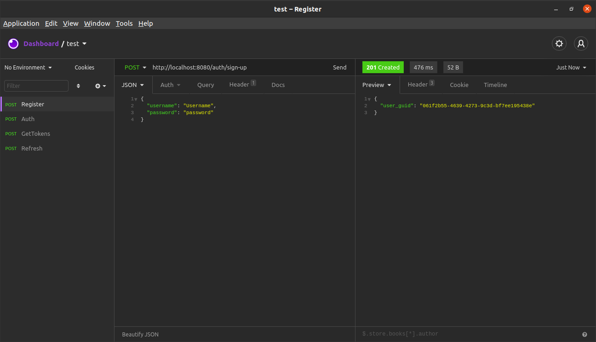
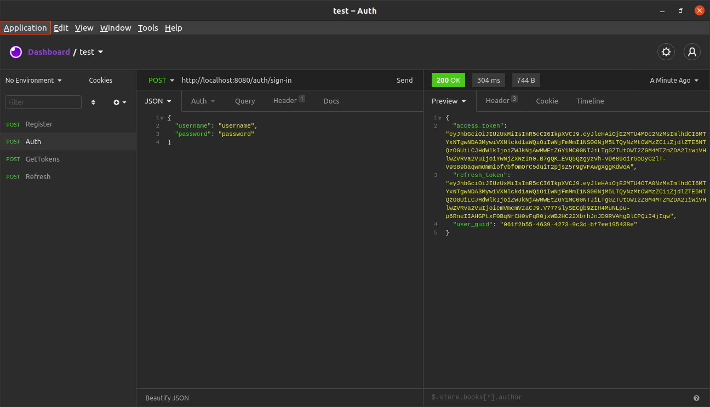
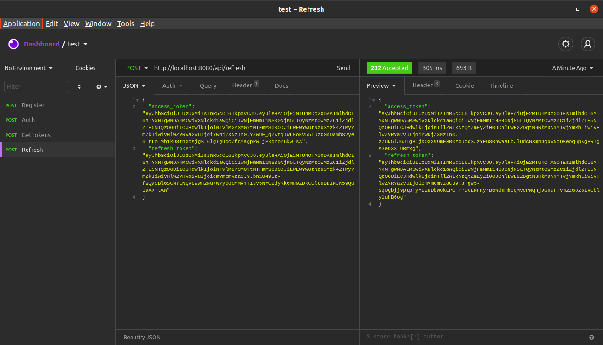

Файл configs/config.yml содержит необходимые для работы приложения конфигурации: 

  port - порт, на котором запускается сервер;

  db:

    uri - uri MongoDB;
    name - наименование базы данных;
    
  tokens:

    key - ключ шифрования токена;
    ttl - время действия токена;
    type - тип токена.

Пути api/tokens_pair и api/refresh предназначены для получение токенов по guid пользователя и refresh токенов соответсвенно.

Для тестирования работы данных путей также реализована логика регистрации пользователя с генерацией guid пользователя, сохранением имении, пароля и guid в коллекции Users и возвратом guid в ответе сервера; а также логика авторизации пользователя, которая возвращает guid пользователя и пару токенов. Путь auth/sign-up для регистрации пользователя; путь auth/sign-in для авторизации.

Для запуска сервера используйте команду $ go run main.go.

Регистрация:

Авторизация:

Получение пары токенов по guid:

Refresh токенов

